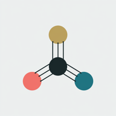

# Tintium

**OKLCH Palette Generator** - A modern color palette generator using the OKLCH color space for creating accessible, harmonious design systems.



## 🎨 Features

- **OKLCH Color Space** - Perceptually uniform colors for better accessibility
- **Semantic Palettes** - Generate complete design systems from seed colors
- **Light & Dark Modes** - Automatic theme generation with proper contrast
- **Live Preview** - See your palette applied to real UI components
- **CSS Export** - Export ready-to-use CSS custom properties
- **URL Sharing** - Share palettes via URL with OKLCH encoding
- **PWA Support** - Install as a Progressive Web App
- **Local Storage** - Save and manage your favorite palettes

## 🚀 Usage

1. **Choose Seed Colors** - Select primary, neutral, and accent colors
2. **Customize Status Colors** - Set success, warning, and error colors
3. **Preview** - See your palette applied to various UI components
4. **Export** - Copy the generated CSS variables
5. **Share** - Share your palette via URL
6. **Save** - Store palettes locally for later use

## 🔗 URL Sharing

Share palettes using compact OKLCH-encoded URLs:

```
?p=58.54_0.204_277.12&n=55.44_0.041_257.42&a=76.86_0.165_70.08&s=72.27_0.192_149.58&w=79.52_0.162_86.05&e=63.68_0.208_25.33
```

Parameters: `p`=primary, `n`=neutral, `a`=accent, `s`=success, `w`=warning, `e`=error  
Format: `L_C_H` (Lightness_Chroma_Hue)

## 🛠️ Technology

- Pure HTML, CSS, and JavaScript
- No build process required
- OKLCH color space for perceptual uniformity
- WCAG contrast calculation for accessibility
- Service Worker for offline support

## 📦 Installation

### As a Website

Simply open `index.html` in a modern browser.

### As a PWA

1. Open the application in a browser
2. Click "Install" when prompted
3. Use as a standalone app

## 🌐 Live Demo

Visit: [https://lawondyss.github.io/Tintium/](https://lawondyss.github.io/Tintium/)

## 📄 License

MIT License - see below for details.

This software is provided "as is", without warranty of any kind, express or implied.

## 🤝 Contributing

Contributions are welcome! Feel free to open issues or submit pull requests.

## 🙏 Credits

Created with 🤖 using the OKLCH color space.
